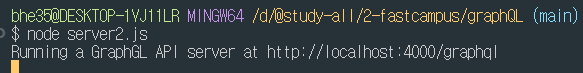

# GrapQL

## Express GraphQL Server 생성하기
### 중속성 설치하기
  ```npm
  npm i -D express express-graphql graphql
  ```
     
  <br>

### Root에 server.js 파일 생성
  ```javascript
  const express = require('express');
  const { buildSchema } = require('graphql');
  const { graphqlHTTP } = require('express-graphql');

  const app = express();
  const port = 4000;

  const schema = buildSchema(`
    type Query {
      description: String
    }
  `);

  const root = {
    description: "hello world"
  }

  app.listen(port, () => {
    console.log(`Running a GraphGL API server at http://localhost:${port}/graphql`)
  });
  app.use('/graphql', graphqlHTTP({
    schema: schema,
    rootValue: root,
    graphiql: true,
  }));
  ```
### server.js 실행
  ```npm
  node server.js
  ```
     
  server.js 실행이 되면 postman을 실행한다
     
  post로 바꾼후 주소를 입력해준다
  그리고 body에서 raw를 선택해 준후 JSON파일로 바꿔준다
  query: "description"을 입력후 Send를 눌러주면 아래와 같이 데이터가 나오는걸 확인할 수 있다

  http://localhost:4000/graphql로 접속
  
  ```JSON
  {
    description
  }
  ```
  을 입력하면 오른쪽에 데이터가 확인된다
  
